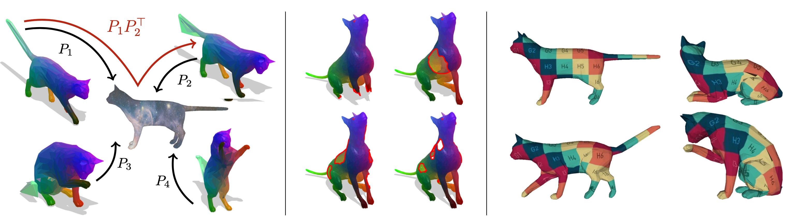

# Isometric Multi-Shape Matching (IsoMuSh)

[Paper-CVF](https://openaccess.thecvf.com/content/CVPR2021/papers/Gao_Isometric_Multi-Shape_Matching_CVPR_2021_paper.pdf) | 
[Paper-arXiv](https://arxiv.org/abs/2012.02689) |
[Video](https://www.youtube.com/watch?v=bDy0wHeBeYU) |
[Code](https://github.com/maolingao/IsoMuSh)



## Citation

If you find our work useful in your research, please consider citing:

```
@inproceedings{gao2021multi,
 title = {Isometric Multi-Shape Matching},
 author = {M. Gao and Z. Lähner and J. Thunberg and D. Cremers and F. Bernard},
 year = {2021},
 booktitle = {{IEEE Conference on Computer Vision and Pattern Recognition (CVPR)}},
 keywords = {Shape Analysis, Geometry Processing, Shape Correspondence, Multi Shape Matching},
}
```

> *Note:* The initial public release in this repository corresponds to
> the code version evluated in the CVPR'21 paper, after refactoring
> and cleanup. As the code evolves, runtime differences might become larger.

## Running IsoMuSh

Since we use **git-lfs** to manage large binary `*.mat` files, you can run following commands to fetch the code and data:

```
git clone <isomush-repo>
git lfs install
git lfs pull
```

Then please refer to `demo1.m` for an example of TOSCA centaur and `demo2.m` for an example of FAUST person.

> *Note:* The code was developed under MacOS and Ubuntu.


## Acknowledgement
We thank the authors of [ZoomOut](https://github.com/llorz/SGA19_zoomOut) (Simone Melzi, Jing Ren, Emanuele Rodolà, Abhishek Sharma, Peter Wonka, and Maks Ovsjanikov.), which we used as initialisation for IsoMuSh. Their code is provided as a copy in this repository for covenience. Some of their functions are adapted for our purposes, such as visualisation functions (`code/external/zoomout`).

We thank the authours of [Numerical geometry of nonrigid shapes](https://link.springer.com/book/10.1007/978-0-387-73301-2) (Alexander & Michael Bronstein) for providing the `fast_marching` library (`code/external/fmm_triangulated`).

We thank Emanuele Rodola for providing the library to compute the shot feature (`/code/external/shot`).

We also thank L. Cosmo, E. Rodola, A. Albarelli, F. Memoli, D. Cremers for open source their published function `fps_euclidean.m`, and anonymous authors of functions (`code/external/io` and `code/external/hks`).

## License

The code of the IsoMush project is licensed under a [GNU Affero General Public License](LICENSE).

Please also
consider licenses of used third-party codes and libraries. See folder `code/external`.
